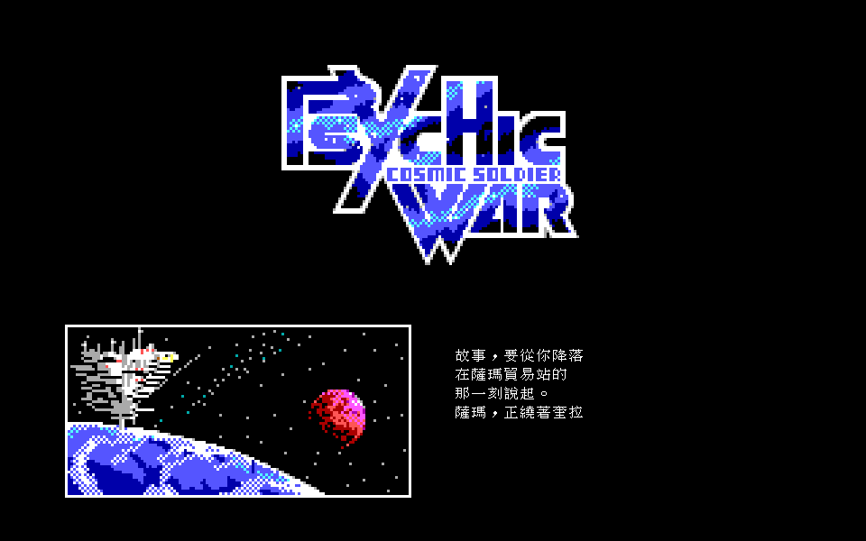
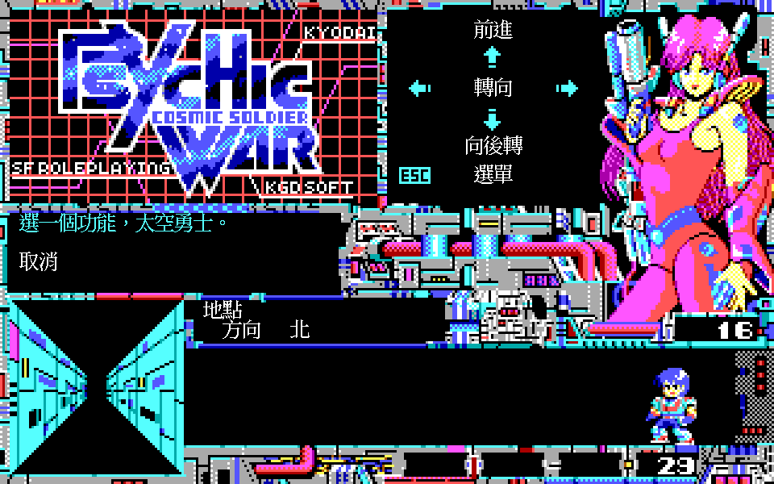
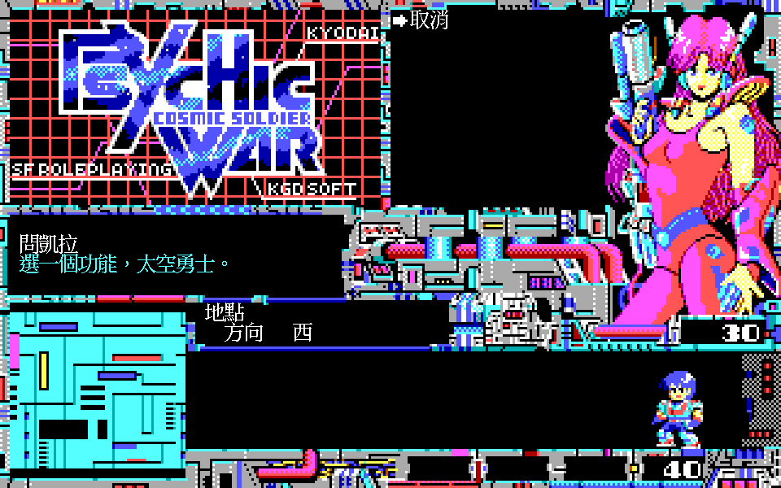
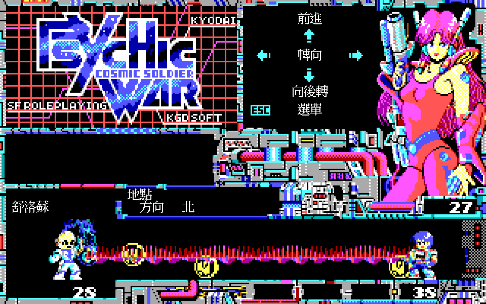
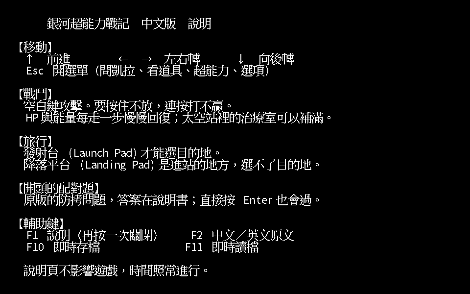

# 銀河超能力戰記 繁體中文化

《銀河超能力戰記》（*Psychic War: Cosmic Soldier 2*，工画堂スタジオ 1987）的繁體中文化。
做法不是重寫遊戲，是讓原版 DOS 執行檔跑在 [dosgolem](https://github.com/wicanr2/dosgolem) 上，
在原版畫字的那一刻攔下來，把中文畫在放大後的畫布上。原版邏輯一行都沒動。



開場字幕。畫面是 dosgolem 執行原版 `PW.EXE` 的實跑輸出，960×600 ＝ 原版 EGA 320×200 整數倍放大 3 倍。
左邊插圖與標題 Logo 是原版圖檔，右邊文字是轉譯層疊上去的中文。

## 這是什麼遊戲

1987 年工画堂スタジオ在 PC-88 上推出的第一人稱迷宮 RPG，《Cosmic Soldier》的續作。
本專案用的是 Kyodai Software 1989 年的 DOS 英文移植版（畫面上的 IBM VERSION），
EGA 320×200 十六色，音樂走 PC 喇叭或 AdLib。
當年台灣由《軟體世界》代理，中文名就叫「銀河超能力戰記」；人名、地名與超能力名稱優先沿用那份說明書的譯法。

故事從西元 3656 年開始。玩家駕駛太空戰艦「世紀諧擬號」從 KGD 星團躍遷到奎拉星系，
和生化複合人凱拉一起降落在貿易站薩瑪，一則古老的預言就此展開。

玩法是走格子迷宮：方向鍵前進與轉向，Esc 開選單問凱拉、看道具、用超能力。
遭遇戰是即時的角力，空白鍵要**按住不放**，連按打不贏。



迷宮裡的一格：左下是第一人稱視野，訊息框留著剛才問凱拉的回話。
右上角的操作面板（前進／轉向／向後轉／選單）與狀態欄（地點／方向）原本是畫進 `.PBL` 圖檔的文字，
不是程式印出來的，所以改用畫面內容比對來觸發替換。



Esc 選單與凱拉的回話，兩者都來自 `I_MENUH.BIN` 的固定寬度欄位。
訊息框、選單項目與狀態欄由不同的印字路徑畫出來，轉譯層四條都攔。



第一場遭遇戰。敵人名字（舒洛蘇）來自 `I_ENMY00.BIN`。
戰鬥雙方的推進都綁在 CPU 指令數上，不是計時器，所以執行速度會直接影響難度，
預設的 750 cycles 對應大約 8 MHz 的 AT。

## 中文化怎麼做的

跟 ScummVM 的分工相同：執行器是通用的，每款遊戲只要準備文本與少量位址表。

| 層 | 放哪 | 內容 |
|---|---|---|
| 機器與觀測 | dosgolem | CPU、DOS／BIOS、EGA、PIT、喇叭、OPL2、狀態存取 |
| 轉譯層機制 | dosgolem `xlate` | 印字攔截介面、放大畫布疊字、熱鍵分派、即時存檔 |
| 遊戲專屬 | 本 repo | 印字常式位址、文本檔、譯名表、字型子集、地圖解讀、作弊位址 |
| 前端 | 本 repo | 視窗、音訊、按鍵對應（Go／Ebiten） |

位址永遠是遊戲專屬的。印字的演算法可以通用，進入點與字串表偏移一律由本 repo 提供給 golem。

替換的單位是「一則訊息」，不是一個字元。中英文長度不對應，逐字元替換必然破版，
所以文本檔的 key 用來源位置（檔名＋偏移），一則一筆。
中文用 24×24 與 18×21 的點陣字畫在放大後的畫布上，不去擠原版的 8×8 字格。

畫面上的文字有兩種來源，兩種都處理了：

- **程式印出來的**：`PW.EXE`、`I_MENU*.BIN`、`I_ENMY*.BIN`、`CODE*.BIN` 裡的字串，
  攔四條印字路徑（`FONT.BIN` 的 8×8 三條、程式內建 6×7 小字型一條）。
- **畫進圖檔的**：`.PBL` 圖檔裡的操作面板、房間招牌、道具圖鑑、開場字幕。
  這些沒有字串可攔，改用畫面內容比對，比中了再蓋上中文。

## 目前到哪裡

| 項目 | 數字 | 出處 |
|---|---|---|
| 文本則數 | 1,389 則抽出，要翻的 1,313 則全部有譯文（其餘 76 則與別則完全相同，指回來源那一筆） | [`docs/re/021`](docs/re/021-translation-first-pass.md) |
| 譯文檢查 | 過長 0、非 Big5 0；譯名表 119 筆（說明書 40、暫譯 79） | [`docs/re/021`](docs/re/021-translation-first-pass.md) |
| 執行時覆蓋 | 重播 19 段觸發 55 則，**觸發了卻不在文本檔的是 0** | [`docs/re/017`](docs/re/017-text-coverage.md)、[`019`](docs/re/019-all-paths-overlay-verification.md) |
| 圖檔文字 | 26 個 `.PBL` 共 537 張圖，含文字 50 張，已疊 48 張 125 塊；沒疊的只剩兩張標題美術字（定案保留原樣） | [`docs/re/024`](docs/re/024-baked-text-overlay.md)、[`031`](docs/re/031-baked-text-rooms-and-map.md) |
| 字型子集 | 966 個漢字，只收譯文用得到的字 | `font/charset.txt` |
| 疊字逐像素驗收 | 8 情境 13 行與原版差 0，反向對照（關掉疊字）差 0 | [`docs/re/019`](docs/re/019-all-paths-overlay-verification.md) |
| 音訊 | PC 喇叭事件逐筆與 DOSBox-X 相同；OPL2 合成器頻譜 0.9117／包絡 0.8119／chroma 0.9836，三項都過門檻 | [`docs/re/006`](docs/re/006-ibm-music-format-and-pc-speaker-parity.md)、[`032`](docs/re/032-opl2-synth-fidelity.md) |

試玩是抽測，不是通關。三次都由模擬玩家操刀：只看截圖、不給攻略、不碰記憶體。

| 次 | 步數 | 走到哪 | 卡住 | 出處 |
|---|---:|---|---|---|
| 1 | 84 | 開機、打贏第一場戰鬥、在發射台選目的地 | 1 次（分不清降落平台與發射台） | [`docs/re/022`](docs/re/022-simulated-player-playtest.md) |
| 2 | 238 | 存檔、8 場以上的戰鬥、兩次抵達賽瓦德 | 1 次（薩瑪出發區的死巷迷宮） | [`docs/re/027`](docs/re/027-sampling-playtest-and-fixes.md) |
| 3 | 60 | 走進電梯房間看招牌、開道具圖鑑 | 0 次 | [`docs/re/031`](docs/re/031-baked-text-rooms-and-map.md) |

找到的缺陷都當場修掉，並用同一個狀態檔重現確認。

還沒做完的：

- 賽瓦德（區域 1）之後的地點沒有抽測過，角色等級不夠打不過去。
- 原版的讀檔入口只在死亡後的標題選單，而那個選單會逾時自動選「新遊戲」，抽測時三次都來不及選。
  目前讀回進度靠 F11 即時讀檔。
- macOS 的發行包沒有在真機上跑過（沒有 Mac，只做了結構驗收，見 [`docs/re/033`](docs/re/033-macos-cross-build.md)）。Windows 版還沒做。
- 主題替換（換 UI 框線與配色）還沒做。

未完成項的權威是 [`docs/worklist.json`](docs/worklist.json)，每條對應一個 GitHub issue。

## 輔助功能

原版沒有這些，全部由轉譯層提供。

| 鍵 | 功能 |
|---|---|
| F1 | 說明頁（再按一次關閉）。開頭防拷問題出現時，這一頁會多一行顯示本題答案 |
| F2 | 中文／英文原文切換。切到英文就完全不畫疊字，畫面與原版逐像素相同 |
| F3 | 自動地圖。只記走過的格子，沒走過的不畫 |
| F10／F11 | 即時存檔／讀檔。存的是機器狀態加疊字層快照，原版執行檔或文本檔的雜湊對不上就拒絕讀回 |
| F5／F6 | 作弊（要加 `-cheat` 才打開）：補滿 HP 與能量／把敵人打到剩 1 點 |

滑鼠也可以用：點操作面板上的項目等於按對應的鍵，包含開選單的 Esc。
原版本身不支援滑鼠（解壓後的執行檔裡 93 處 `INT` 指令沒有 `33h`），這是轉譯層加的。



F1 說明頁。內容來自 `text/help.json`，驗收時由文本檔與字型算出期望畫面，和實跑截圖逐像素比對。

## 怎麼跑

**要自備原版。** 本 repo 不含 `PW.EXE`、`.PBL`、`.BIN`、`.MID` 或任何磁碟映像，
也不提供取得管道。需要的是 Kyodai Software 1989 年的 DOS 英文版：

| 檔案 | 大小 | SHA-256 |
|---|---:|---|
| `PW.EXE` | 58,649 | `88321206d5400b2276aba0f268e2daaa8355a733843dd9e89f9e7116ae690c49` |
| `LOGO.EXE` | 23,136 | `08a4e38b051c29381296fdf3d075eac55dc215d52cf43b9caf955c8deccfc1ba` |

位址表只對這個版本成立。抽取工具會先驗雜湊，不符就停下來列出不符的檔案，不猜測。

### 用發行包

`tools/package.sh` 產出三種（規格 [`docs/spec/021`](docs/spec/021-packaging.md)）：

| 產物 | 狀態 |
|---|---|
| `psychicwar-<版本>-linux-x86_64.tar.gz` | 解開產物實跑驗過 |
| `PsychicWar-<版本>-x86_64.AppImage` | 同上 |
| `PsychicWar-<版本>-macos.zip`（universal，x86_64 ＋ arm64） | 只做了靜態驗收，**沒有在 Mac 上跑過** |

解開之後指定原版目錄就能跑，資料檔跟著執行檔走，不必從特定目錄啟動：

```sh
./psychicwar -orig /path/to/psychic-war        # 含 PW.EXE 的目錄
```

存檔（遊戲存檔與 F10 即時存檔）寫在使用者資料目錄，不是解開的地方：
Linux 是 `$XDG_DATA_HOME/psychicwar`（預設 `~/.local/share/psychicwar`），
macOS 是 `~/Library/Application Support/PsychicWar`。

macOS 的 `.app` 沒有簽章也沒有公證（在 Linux 上做不出來），首次開啟要**右鍵 →「打開」**。

### 自己建置

建置與實跑都走 docker：

```sh
# 原版解開到 workplace/original/psychic-war/（裡面要有 PW.EXE）
tools/go-ebiten.sh build -o /src/workplace/bin/psychicwar ./cmd/psychicwar
workplace/bin/psychicwar -orig workplace/original/psychic-war   # 從 repo 根目錄執行

tools/package.sh all       # 或 linux／appimage／macos，產物在 dist/
```

字型子集（`font/cjk24.golemfnt`、`font/cjk16.golemfnt`）已經在版控裡，不必自己烘。
改了譯文、用到新字時才跑 `tools/font/bake.sh` 重烘一次，來源字型放在 `workplace/font-src/`。

常用旗標：`-adlib` 走 OPL2 音樂（不加就是 PC 喇叭）、`-scale` 放大倍率（預設 3）、
`-cycles` 執行速度（預設 750，約 8 MHz AT；`xt` 是 XT 級）、`-cheat` 打開作弊鍵、
`-text off` 關掉中文疊字。

dosgolem 目前用本機分支（`go.mod` 的 `replace` 指到 `worktrees/dosgolem`），第一次建置要先 clone 它。

## 文件

- [`CLAUDE.md`](CLAUDE.md)：專案規則、已確認的事實表、工具表。
- [`docs/goal/`](docs/goal/)：分期目標與驗收條件。
- [`docs/spec/`](docs/spec/)：規格，標 `DRAFT` 或 `READY`。只有 `READY` 的可以動手實作。
- [`docs/re/`](docs/re/)：反組譯與量測紀錄，編號與日期都在。
  被推翻的斷言集中在 [`000-overturned-claims.md`](docs/re/000-overturned-claims.md)。
- [`docs/worklist.json`](docs/worklist.json)：未完成項，每條掛一個可執行的驗證方式。

## 授權

本作品採 **RRSAL-1.0**（復古重製 source-available 授權條款），全文見 [`LICENSE`](LICENSE)。摘要：

- 非商業使用免費，可以修改、可以再散布。
- 實況、錄影、截圖與教學明示允許。
- 修改後散布要附上原始碼與修改說明。
- 商業使用要另外談，聯絡 wicanr2@gmail.com。

**授權不涵蓋原版素材。** 原版的程式、圖、音樂與文字屬於原權利人，使用本作品的人必須自備合法的原版副本。
repo 裡為了研究與對照保留的原版片段（文本檔的原文欄位、量測得出的位址與座標表、含原版底圖的截圖）
不在授權範圍內。

**中文字模**來自倚天中文系統 3.53 的點陣字（24 點與 16 點），只取譯文用得到的 966 個字烘成子集
（`font/cjk24.golemfnt`、`font/cjk16.golemfnt`），倚天沒有的字用 Noto Sans CJK TC 補。
選它是因為字形接近當年代理版的觀感。若權利人有意見，請寄 wicanr2@gmail.com，會移除字型子集
並改用授權明確的替代（`docs/re/020` 列了四個備案，換字型只要重跑烘字腳本，疊字層不用改）。

本專案與工画堂スタジオ（Kogado Studio）、Kyodai Software 沒有隸屬、合作、贊助或授權關係，
是獨立的第三方保存與研究專案。
