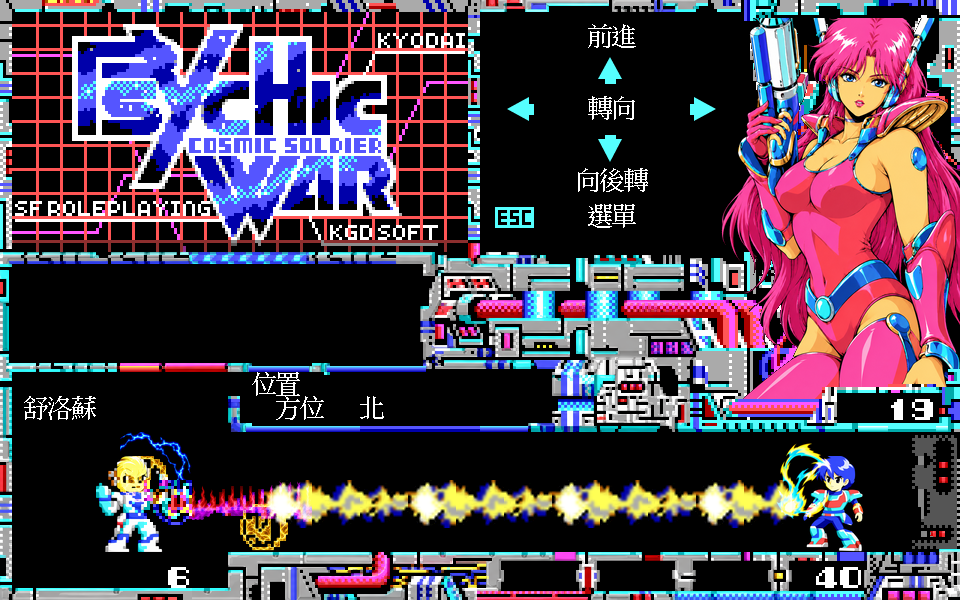
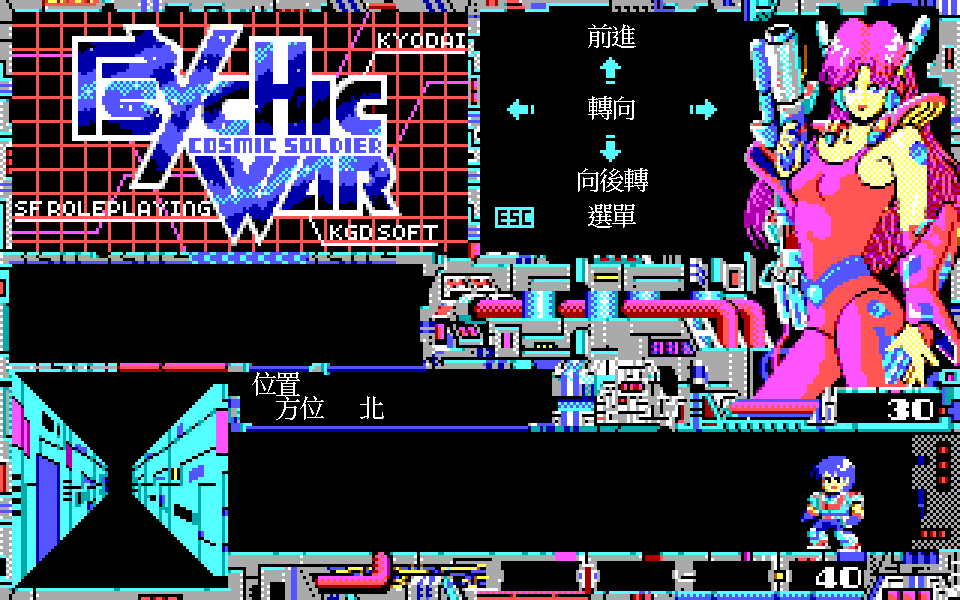
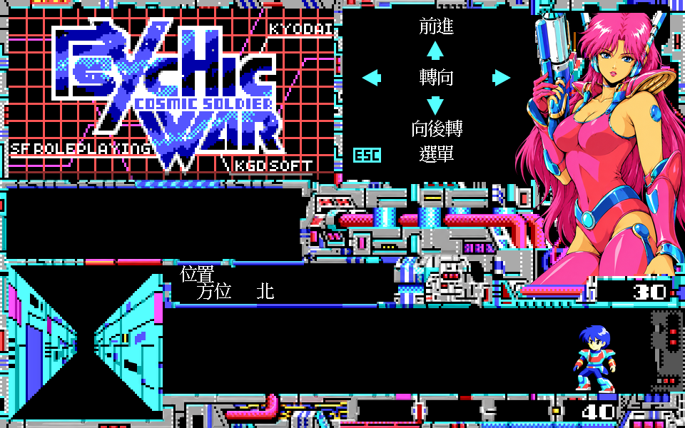

# 銀河超能力戰記：繁體中文版與 HD 主題

走進太空站的迷宮，招募超能戰士，與凱拉一起阻止帝國的下一場戰爭。

本專案將《Psychic War: Cosmic Soldier 2》的 DOS 英文版帶回繁體中文玩家面前，加入中文劇情、選單與操作說明，並完成沿用原版造型的 HD 主題。遊戲由 [dosgolem](https://github.com/wicanr2/dosgolem) 執行原版程式，保留原有規則與遊玩方式。



**1.0.0 正式版實際遊玩畫面。** 下方是超能戰士之間的攻防，右側是同行的凱拉；人物與戰鬥效果採用 HD 圖面，中文介面沿原版位置呈現。

[下載 1.0.0 正式版](https://github.com/wicanr2/psychic_war_cht/releases/tag/v.1.0.0-20261008) · [版本與已知限制](CONTEXT.md)

公開下載包需要自備 **Kyodai Software 1989 年 DOS 英文版**的完整遊戲資料。以下 HD 畫面是本機完整版的展示；公開包不附原版資料或 HD 素材包。

## 戰爭前夕

西元 3656 年，KGD 星團才剛享有四年的自由，帝國的威脅便再次逼近。

這片星團曾遭帝國入侵，領導人受到控制，拒絕屈服的三個主要聯邦也在長年的戰鬥中敗下陣來。漫長的統治直到 3652 年才告終。如今，帝國又發展出新的「超能波」，準備發動總攻擊；剛獲得解放的星團，必須再次面對戰爭。

你是聯邦上議院派出的超能戰士。任務是在帝國出兵之前，深入奎拉星系，摧毀支撐其軍事力量的衛星系統。與你同行的凱拉是一名生化複合人，曾參與解救 KGD 星團的戰役。這一次，她將陪你探索基地、運用裝備，對抗帝國的超能力部隊。

旅程從帝國星系外環的中立貿易站「薩瑪」開始。你們需要在陌生的走廊中尋找情報與補給，和其他戰士交談，組成能夠繼續深入敵境的隊伍。通往下一個基地的路，藏在迷宮、房間與人們提供的線索之間。

故事設定依[軟體世界代理版說明書](docs/manual-1989.md)轉述。原作由工画堂スタジオ於 1987 年在 PC-88 推出，是《Cosmic Soldier》的續作；本專案採用 1989 年的 DOS 英文移植版，人物、地名與超能力名稱優先沿用台灣當年的譯名。

## 你會怎麼玩

這是一款第一人稱迷宮 RPG。前進、轉向、記住岔路，尋找治療室、修復站與發射台；打開選單詢問凱拉、查看道具，逐步取得前往下一座基地所需的線索。遇到其他超能戰士時，交談可能帶來情報，也可能讓隊伍多一位同伴。

遭遇戰則是即時的超能力角力。**按住空白鍵持續攻擊**，用防護盾抵擋，必要時嘗試撤離。戰友、裝備與超能力會影響你能走多遠；探索途中也要留意隊伍的體力與能量。

## 中文與 HD 的成果

| 內容 | 玩家看得到的改變 |
|---|---|
| 繁體中文 | 完成 1,313 則譯文，涵蓋劇情、對話、選單與道具說明；面板、房間招牌和開場字幕也呈現中文。兩張標題美術字保留原樣。 |
| HD 主題 | 重繪人物、迷宮、房間、地圖與戰鬥效果，完成 531 個目標圖像的對應；保留原版位置、比例、姿勢與框線前後關係。 |
| 隨時切換 | `F5` 切換中文與英文，`Shift+F5` 切換已載入的 HD 主題與原版畫面，兩者可以分開選擇。 |
| 遊玩便利 | 加入說明頁、自動地圖與即時存讀檔；探索和對話可加速，戰鬥維持原速。 |

### 同一位置，切換原版與 HD

| 原版畫面 | HD 主題 |
|---|---|
|  |  |

以上兩張來自 **1.0.0 正式封包的同一段實際遊玩**，在原地使用 `Shift+F5` 切換。右側凱拉、下方戰士與操作圖示的差異最容易看見；文字、人物與視窗的位置保持一致。

本機另備有 73 秒推廣片，其中 65 秒是從正式封包正常開機後錄下的遊玩，包含迷宮移動、戰鬥與四次原版／HD 切換。影片含原版音樂與 HD，因此未附在公開 Release。

1.0.0 已抽測正常開機、探索、戰鬥、道具與存讀檔，**尚未做完整通關測試**。Linux 已實跑；Windows 經 Wine 抽測，macOS 完成封包結構檢查，兩者仍待[真機驗收](https://github.com/wicanr2/psychic_war_cht/issues/44)。詳細範圍與限制集中在 [CONTEXT.md](CONTEXT.md)。

## 開始遊玩

1. 從[正式版下載頁](https://github.com/wicanr2/psychic_war_cht/releases/tag/v.1.0.0-20261008)選擇平台：Linux AppImage、Windows ZIP，或支援 Intel／Apple Silicon 的 macOS ZIP。
2. 準備合法持有的 DOS 英文版**完整資料夾**，其中必須有 `PW.EXE`；只有執行檔不足以啟動遊戲。
3. 依平台放好資料後啟動：

| 平台 | 放置與啟動方式 |
|---|---|
| Windows | 解壓 ZIP，把遊戲資料放進 `PsychicWar.exe` 旁的 `original` 資料夾，再開啟程式。 |
| macOS | 把遊戲資料放進 `PsychicWar.app/Contents/Resources/original`。首次開啟可能需要右鍵選「打開」；此版未經開發者簽章與公證。 |
| Linux | 指定遊戲資料夾啟動，範例如下。沒有 FUSE 時，可加上 `--appimage-extract-and-run`。 |

```sh
./PsychicWar-v.1.0.0-20261008-x86_64.AppImage -orig /path/to/psychic-war
```

含原版資料與全部 HD 的本機完整版，Linux 與 macOS 會直接載入內附 HD；Windows 使用 `Start-HD.bat`。這些完整版只留本機，不提供公開下載。

存檔會放在使用者資料目錄，重新解壓程式不會覆蓋進度：

| 平台 | 存檔位置 |
|---|---|
| Windows | `%APPDATA%\PsychicWar` |
| macOS | `~/Library/Application Support/PsychicWar` |
| Linux | `~/.local/share/psychicwar`，或自訂的 `$XDG_DATA_HOME/psychicwar` |

### 常用操作

| 按鍵 | 功能 |
|---|---|
| `↑`、`←`、`→`、`↓` | 前進、左右轉、向後轉 |
| `Esc` | 開啟選單，詢問凱拉、看道具、使用超能力或儲存遊戲 |
| 按住空白鍵／`Enter` | 持續攻擊／使用防護盾 |
| `F2`／`F3` | 交談、招募／嘗試脫離戰鬥 |
| `F4` | 開啟或關閉完整說明頁 |
| `F5`／`Shift+F5` | 中文與英文／已載入的 HD 與原版畫面切換 |
| `F6` | 自動地圖，只記錄走過的地方 |
| `F10`／`F11` | 即時存檔／即時讀檔 |
| `F12` | 探索與對話速度切換為 1、2、3 倍，戰鬥維持原速 |

名字沿用原版限制，請使用英文字母與數字。滑鼠也能點選畫面上的操作面板；其他操作可在遊戲內按 `F4` 查看。

## 想看更多

- [台灣代理版說明書整理](docs/manual-1989.md)：故事設定、術語與原版操作。
- [目前成果與已知限制](CONTEXT.md)：驗收範圍及現行證據入口。
- [開發與建置](docs/DEV-SETUP.md)：工具、打包及影音流程。
- [研究紀錄](docs/re/)與[規格](docs/spec/)：中文化、HD 和原版行為的查證。
- [工作歷程](WORKLOG.md)與[未完成項目](docs/worklist.json)。

## 授權與致謝

本專案採 [RRSAL-1.0](LICENSE)：非商業使用免費，允許修改、再散布，以及實況、錄影、截圖與教學；修改後散布須附原始碼與修改說明。商業使用請聯絡 **wicanr2@gmail.com**，完整條件以授權全文為準。

授權不涵蓋原版程式、美術、音樂與文字，其權利屬於原權利人。README 的實機截圖僅供成果展示，不表示原版或整套 HD 素材可以再散布。

中文字模採倚天中文系統 3.53 的 24 點與 16 點字形子集，缺字由 Noto Sans CJK TC 補足，以保留接近當年代理版的閱讀感受。若字型權利人有意見，請寄 **wicanr2@gmail.com**，將移除相關子集並改用替代字型。

感謝工画堂スタジオ的原作，以及軟體世界當年的代理與中文說明書。本專案是獨立的第三方保存與研究工作，與工画堂スタジオ、Kyodai Software 沒有隸屬、合作、贊助或授權關係。
