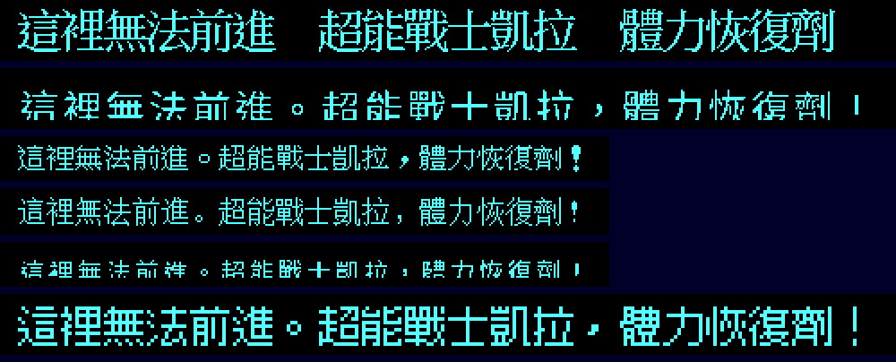

# 020：中文字型的授權選項

狀態：比較紀錄（2026-09-17），**待使用者決定**。對應 issue #21、#36。

## 1. 問題

目前疊字用的漢字是倚天中文系統 3.53 的點陣字（24 點 `STD.24M`、16 點 `STDFONT.15`＋`SPCFONT.15`）。
倚天是商業軟體，字模能不能隨中文化散布沒有確認過。本 repo 目前 private，公開或發行前一定要換掉或取得授權。

## 2. 同一句話的字形對照

由上到下（圖是原始點陣放大 2 倍）：

| 列 | 字型 | 大小 | 授權 | 看起來 |
|---|---|---|---|---|
| 1 | 倚天 24 點明體 | 24×24 | 未確認（商業軟體） | 1990 年代 DOS 中文的原味；筆畫清楚 |
| 2 | Noto Sans CJK TC 22 pt 點陣化 | 24×24 | SIL OFL 1.1 | 細筆畫在二值化後斷裂（「這」「進」「體」缺筆），不適合 |
| 3 | 倚天 16 點 | 16×15 | 未確認 | 清楚，含全形標點 |
| 4 | GNU Unifont | 16×16 | SIL OFL 1.1＋GPL 字型嵌入例外（見 `~/cht/sangokushi/fonts/LICENSE-unifont.txt`） | 清楚，涵蓋 Big5 全部字 |
| 5 | Noto Sans CJK TC 14 pt 點陣化 | 16×15 | SIL OFL 1.1 | 大量缺筆，不可用 |
| 6 | 俐方體 11 號（Cubic 11） | 12×12 | SIL OFL 1.1（字型發行頁；引入時要附 OFL 全文並再核對一次） | 為小尺寸設計的點陣字，放大 2 倍很銳利；字級比其他列小 |

## 3. 可行組合

| 方案 | `FONT.BIN` 路徑（8×8 字格 → 24×24） | 小字型路徑（6×7 字格 → 18×21） | 取捨 |
|---|---|---|---|
| A 維持倚天 | 倚天 24 點 | 倚天 16 點 | 最接近當年代理版的觀感；**不能公開散布**，除非取得授權或改成「玩家自備倚天字型檔」 |
| B Unifont | Unifont 16×16 放大 1.5 倍不是整數，改成 16×16 置中在 24×24（四周留白） | Unifont 16×16 | 授權清楚；24 點路徑的字會比格子小一圈 |
| C 俐方體 11 號 | 12×12 放大 2 倍 ＝ 24×24 | 12×12 置中在 18×21 | 授權清楚、點陣風格一致；小字型路徑的字偏小 |
| D 混合 | 俐方體 11 號 ×2 | Unifont 16×16 | 兩條路徑各用最適合的尺寸；兩種字型筆畫風格不同 |
| E 玩家自備倚天 | 同 A，但字型檔不隨發行，啟動時從玩家指定的倚天安裝目錄讀 | 同 A | 保留原味且不散布；多一個玩家要準備的檔案，缺檔時退回 B 或 C |

- 切換字型只要重跑 `tools/font/bake.sh` 並改 `docs/spec/009` §2 的字模偏移；疊字層與驗收工具不需要改（字模大小與偏移都是參數）。
- Noto Sans CJK 的點陣化在這兩個尺寸都不可用，只適合當標點與少數缺字的補字來源，而且要調字級與閾值（knowledge-base `eten-bitmap-font` 的烘字經驗）。

## 4. 建議

公開前用 **D（俐方體 11 號 ×2 ＋ Unifont 16）**，另外保留 **E** 當選項給想要原味的玩家。決定前維持 A（repo private）。
